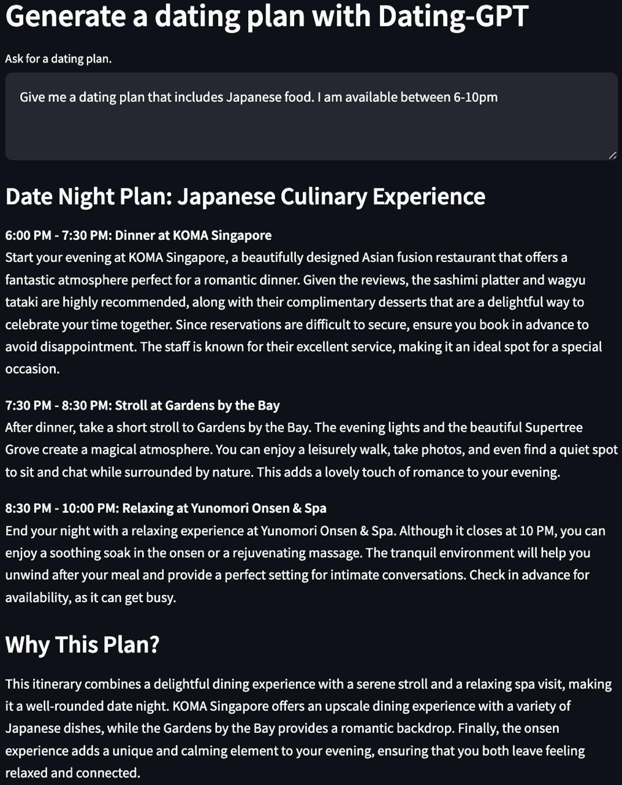

# Dating-GPT

## TLDR


## Background
This project aims to deliver a unique and interesting spin on dating by combining conversation potential with custom architectural design. It uses the powerful GPT-4 API by OpenAI to suggest dating plans based on the user's unique question. Imagine a dating plan that goes beyond your regular dinner and movie night - our model offers detailed plans for morning, afternoon and evening, carefully crafted to the individual's input.

GPT-4 is the latest in OpenAI's Generative Pretrained Transformer series. Leveraging huge amounts of data and machine learning capabilities, it can generate human-like text that reads in a coherent and contextual manner. For this reason, it has vast potential in a variety of use cases - from generating creative content, intelligent virtual assistants, conversational AI, content curation, tutoring systems, code generation, and much more. This project underlines this potential by using the technology to enhance human experiences, like dating.

## Getting Started
Following the commands will lead you to deploy a streamlit application locally. 

### Deploy locally 

1. Clone this repository to your local machine.
```bash
git clone https://github.com/YourUsername/project-repo.git
```

2. Install the necessary Python packages.
```bash
pip3 install -r requirements.txt
```

3. Build the Docker image.
```bash
# export OPENAI_API_KEY=<insert api key> && streamlit run main.py
```

**Please replace `<your_api_key>` with your actual OpenAI API key in step 3.**

## Deploy via Docker Compose 

1. Clone this repository to your local machine.
```bash
git clone https://github.com/YourUsername/project-repo.git
```

1. Set your OpenAI API key as an environment variable:
```bash
# OPENAI_API_KEY=<insert api key> docker-compose up --build
```

The service will now be accessible at `localhost:8527`.

## Examples
To use the application, navigate to `localhost:8527` in your web browser. You will be prompted to ask for a dating plan. Write your query into the input field and the model will create a unique dating plan for you based on your input.

For example: 
- User query: "I would like a romantic but adventurous park-themed dating plan."
- Output: Detailed plan on activities for morning, afternoon, and night.

## Future Work
Future enhancements planned for this project include:
- Ability for users to refine prompts through a guided Q/A interface.
- Integration with external APIs for more dynamic responses.
- Improving the user interface for a more engaging user experience.
  
## Contributors
[Samuel Koh](mailto:samuelkohzk@gmail.com)